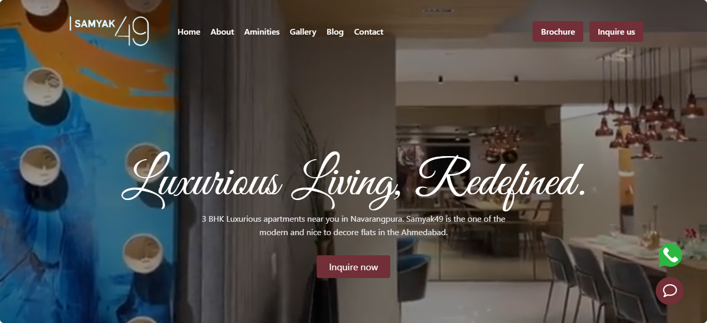

# Real-estate website built with Vue.js & Tailwind CSS
Recently I built a project for a client which consist of a basic website for a real-estate project. Here is the sneak-peak into the project and more is coming soon.



## Project setup
```
yarn install
```

### Compiles and hot-reloads for development
```
yarn serve
```

### Compiles and minifies for production
```
yarn build
```

### Lints and fixes files
```
yarn lint
```

### Customize configuration
See [Configuration Reference](https://cli.vuejs.org/config/).
